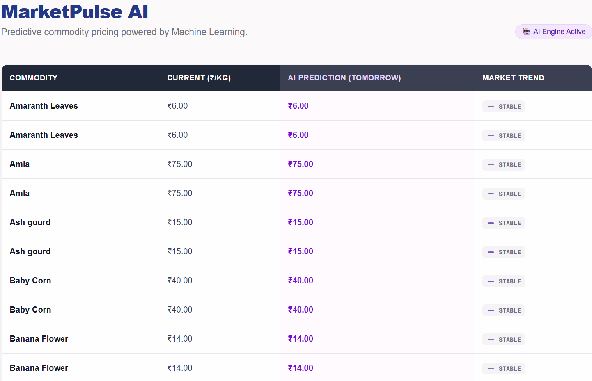
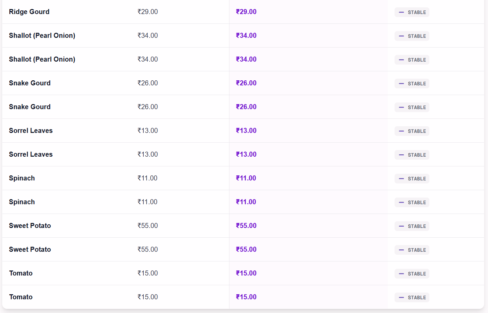
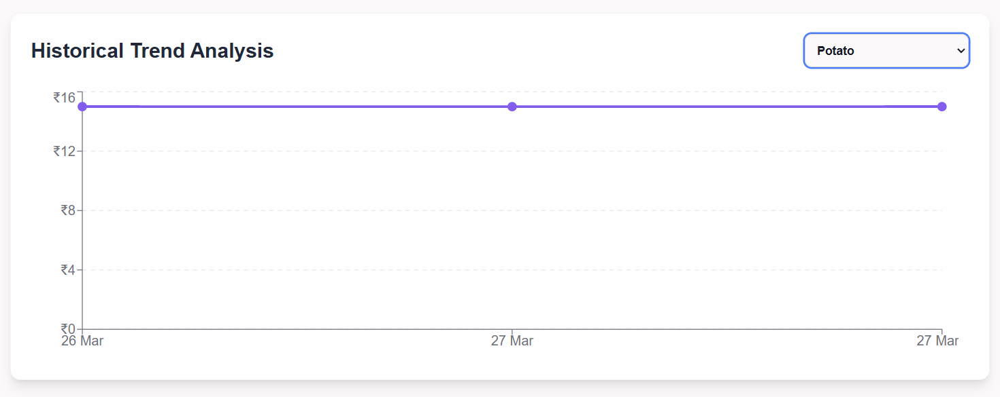
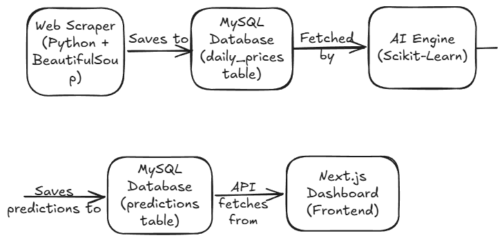

# 📈 MarketPulse: AI-Powered Commodity Tracker





## 🚀 Overview
MarketPulse is an automated, end-to-end data pipeline and full-stack web application designed to track, analyze, and predict the daily wholesale prices of agricultural commodities. 

By combining web scraping, relational database management, and machine learning, this platform empowers users to make data-driven purchasing decisions by identifying market anomalies and forecasting future price trends.

## ✨ Key Features
* **Automated Data Ingestion (ETL):** Custom Python scripts scrape live market data daily, transforming and loading it into a structured MySQL database.
* **Predictive AI Modeling:** Utilizes Scikit-Learn (Linear Regression) to analyze historical time-series data and predict next-day commodity prices.
* **Trend Analysis:** Automatically flags commodities as 📈 UP, 📉 DOWN, or ➖ STABLE based on AI forecasting.
* **Real-Time Dashboard:** A responsive, modern UI built with Next.js, Tailwind CSS, and Recharts that fetches live predictions and historical trends via REST APIs.
* **Zero-Touch Automation:** The entire pipeline (Scraping -> ML Training -> Database Update) is fully automated via scheduled batch scripts and cron jobs.

## 🛠️ Tech Stack
* **Frontend:** Next.js (App Router), TypeScript, Tailwind CSS, Recharts
* **Backend & API:** Node.js (Next.js API Routes)
* **Data Engineering:** Python, BeautifulSoup4, Pandas, SQLAlchemy
* **Machine Learning:** Scikit-Learn (Linear Regression), NumPy
* **Database:** MySQL (Relational Schema Design)

## 🏗️ System Architecture


1. **Extraction:** `scrape_prices.py` fetches raw HTML tables from public market portals.
2. **Transformation:** Pandas cleans the data, handles missing values, and calculates averages for price ranges.
3. **Loading:** Data is appended to the `daily_prices` MySQL table.
4. **Machine Learning:** `predict_prices.py` queries the DB, trains a regression model on time-series dates, and outputs tomorrow's predictions to the `predictions` table.
5. **Presentation:** Next.js API routes execute a SQL `LEFT JOIN` to merge current prices with AI predictions, displaying the unified data on the React dashboard.

## 💻 Local Setup & Installation

### Prerequisites
* Python 3.8+
* Node.js v18+
* MySQL Server

### 1. Database Setup
Create the MySQL database:
```sql
CREATE DATABASE marketpulse_db;
```
### 2. Python Backend (Data Pipeline)
Clone the repository and install the data science dependencies:

```sql
python -m venv venv
venv\Scripts\activate
pip install python-dotenv requests beautifulsoup4 pandas sqlalchemy pymysql scikit-learn
```
Create a .env file with your DATABASE_URL, then run the pipeline:

```sql
python scrape_prices.py
python predict_prices.py
```
### 3. Next.js Frontend
Navigate to the frontend directory and install dependencies:

```sql
cd marketpulse-frontend
npm install
```
Create a .env.local file with your DB_PASSWORD. Start the development server:

```sql
npm run dev
```
Visit http://localhost:3000 to view the dashboard.

⚙️ Automation
The data pipeline is fully automated using Windows Task Scheduler executing the run_pipeline.bat script daily at midnight, ensuring the AI model is always trained on the freshest data.

👨‍💻 Author
Naveen Sharma
B.Tech Computer Science (Data Science), Kazi Nazrul University, Asansol

[LinkedIn Profile](https://www.linkedin.com/in/naveen-sharma-a34365293) | [Portfolio Website](https://naveen-s-portfolio-one.vercel.app/) | [GitHub](https://github.com/naveencoding75/)